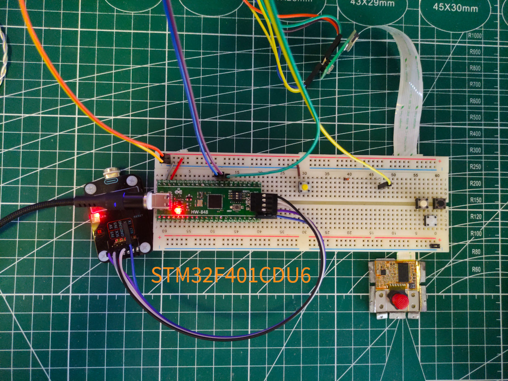

# stm32f4-trackpoint-mouse

## Let trackpoint module works on stm32f4 with rust embedded

---

Several years ago, I built a trackpoint keyboard (use tmk repo and convert [arduino-trackpoint-extended](https://github.com/rampadc/arduino-trackpoint-extended) to c).

Recently, I lost my python job, but I feel so happy to start my own project: Rebuild/Rewrite my trackpoint keyboard in rust :D.

[Legacy c version](https://github.com/gzeronet/teensy-trackpoint-tmk-keyboard)

---

## Why Rebuild?

* Replaced developing board, teensy 2.0 board is too expensive, stm32f401 is cheaper enough.
* Want to learn rust with its embedded developing to improve my code language kills, seems no such sample/crate for teensy 2.
* Feels rust embedded is easier than c/c++ to learn. Just follow stmcubeide to build c projects, it drives me crazy.
* I like trackpoint than any other mouse hid, but not found frameware in rust version.

So, I tried rewriting the module in rust, and it works perfect as I wanted now.

---

## Feature

* Use stm32f4xx_hal, rtic, usb related.
* TIM EXTI, (GPIO EXTI not work on dynamic pin, hope some one can help).
* Trackpoint stream mode, (remote mode works, but I not need it).

---

## Build

> cargo objcopy --bin trackpoint_mouse -- -O binary trackpoint_mouse.bin

> dfu-util -d 0483:df11 -a 0 --dfuse-address 0x08000000 -D trackpoint_mouse.bin

---

## Known Issue

Debug bin works fine, it looks weird that release build bin not work. Seems the while loop for scl is blocked when reading trackpoint byte. Not sure how to fix it, need experter help.

---

## TODO

Include keyoard code part like [keyberon](https://github.com/TeXitoi/keyberon), maybe will adjust the repo name.
